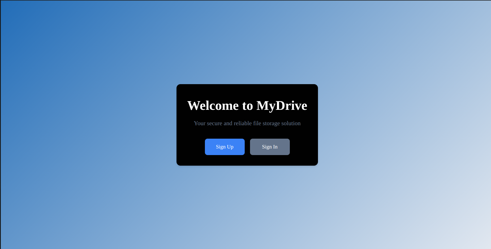
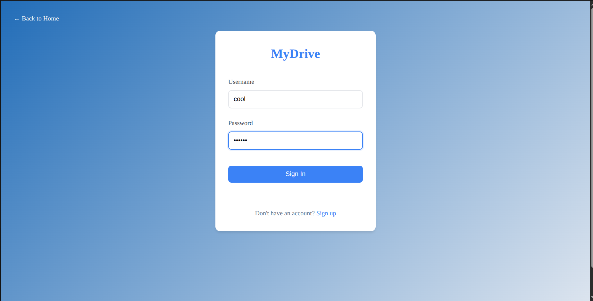
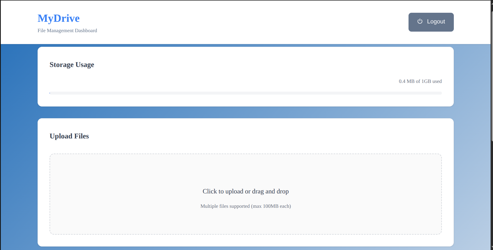
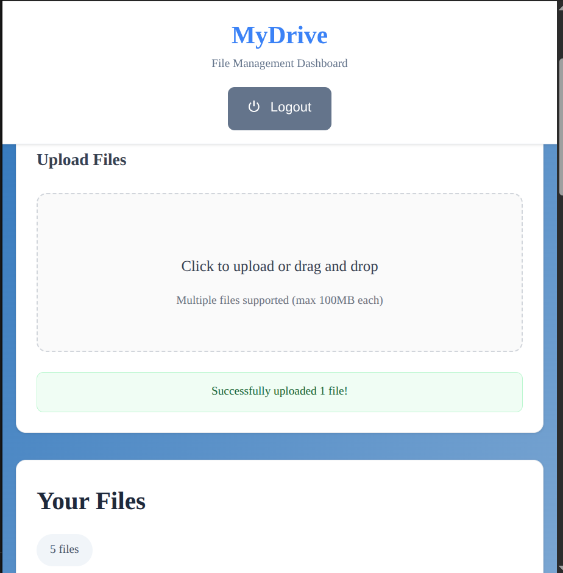
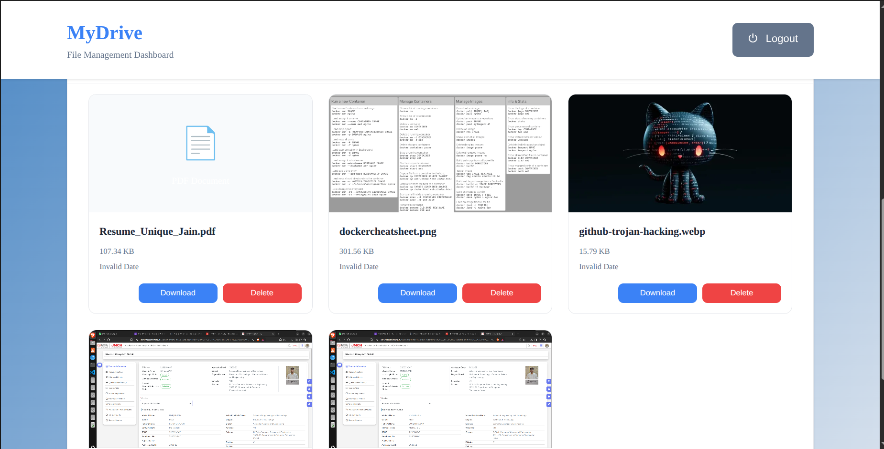

# MY DRIVE

MY DRIVE is a full‑stack web application for storing files and file manager with secure user access, built on AWS S3 infrastructure.

## Features

- **User Authentication** – Secure JWT-based authentication with password hashing.
- **Scalable Cloud Storage** – Leverages AWS S3 for robust and highly available file storage, allowing for seamless management of files of any size.
- **Secure File Access** – Generates pre-signed URLs to provide temporary, secure, and direct access to your files, enhancing data privacy and control.
- **Efficient Metadata Management** – Utilizes a lightweight SQLite database to efficiently store and manage metadata for all uploaded files.
- **Containerized Deployment** – Fully dockerized for easy, consistent, and reproducible deployment across any environment, simplifying the setup and scaling process.

## Tech Stack

- **Frontend**: HTML, CSS, JAVASCRIPT
- **Backend**: Node.js, Express.js
- **Database**: SQLite
- **Storage**: AWS S3
- **Authentication**: JWT with bcrypt
- **Deployment**: Docker

## Installation

1. Clone or extract the repository.
2. Navigate to the `src` and `public` directories and run `npm install` in each to install dependencies. Ensure you have Node.js installed.
3. Create a `.env` file based on `.env.example` and set:

   ```env
   AWS_ACCESS_KEY_ID= <your access key ID>
   AWS_SECRET_ACCESS_KEY= <your secret access key>
   AWS_S3_REGION= <your s3 bucket region>
   AWS_S3_BUCKET_NAME= <your s3 bucket name>
   JWT_SECRET= <your secret key>
   ```

4. Start the backend server:

   ```bash
   node server.js
   ```

5. Start the frontend in development mode:

   ```bash
   npm run dev
   ```

   The frontend will run at `http://localhost:3000`.

### Production build

To generate an optimized production build of the frontend, run:

```bash
npm run build
npm start
```

This builds the app for production and starts a server that serves the prebuilt pages.

### Docker Image
```bash
docker push uniquejn30/mydrive:tagname
```

## Usage

- Home Page: Visit the home page and sign up or sign In (Authorize Your Requests: For all protected actions).
- Upload Files: You can upload a file by Drag & Drop or Click on upload files (Your file will be securely stored in AWS S3).
- Access Your Files Anywhere: Easily view or download your files from any device with an internet connection.
- Control Your Data: You have full control over your files. Only you can see your files, and you can add or delete them whenever you want.

## Screenshots
| Operation                     | Screenshot                                |
|------------------------------|--------------------------------------------|
| ✅ Home             |  |
| ✅ SignIn            |  |
| ✅ Dashboard          |  |
| ✅ Upload Files         |  |
| ✅ Download & delete files             |  |

## Watch Demo Video  
- https://drive.google.com/file/d/1yM0N0JXN92yiYBVSlEPMYYqL8wBvRWUK/view?usp=sharing

## Contributing

Contributions are welcome! Fork the repository and open a pull request with your improvements.

## License

This project is licensed under the MIT License.
